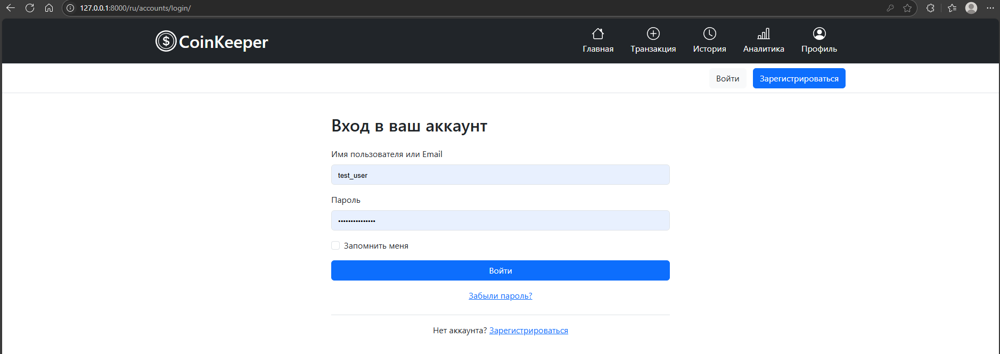
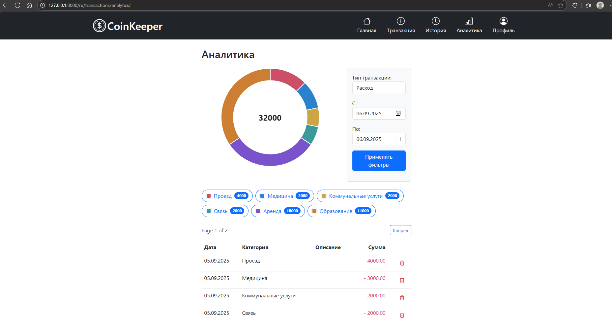

# CoinKeeper 📊

**CoinKeeper** — это веб-приложение для учета личных финансов, построенное на Django. Позволяет отслеживать доходы и расходы, анализировать финансовые привычки и визуализировать статистику с помощью интерактивных диаграмм.

## ✨ Возможности

- **💰 Учет операций**: Добавление, просмотр и удаление доходов/расходов
- **📊 Аналитика**: Визуализация финансовой статистики с помощью Chart.js
- **📅 Фильтрация**: Анализ данных за произвольные периоды времени
- **👤 Аутентификация**: Полноценная система регистрации и авторизации
- **🔐 Безопасность**: Подтверждение email, восстановление пароля
- **🎯 Категории**: Детальный анализ расходов по категориям

## 🖼️ Скриншоты

### Вход


### Аналитика


### Добавление транзакции


## 🛠 Технологический стек

### Backend
- **Django** — основной веб-фреймворк
- **Django Templates** — рендеринг HTML
- **PostgreSQL** — база данных
- **Django Auth System** — система аутентификации

### Frontend
- **Bootstrap 5** — CSS-фреймворк
- **Chart.js** — построение диаграмм и графиков
- **JavaScript** — интерактивность на клиенте
- **HTML5/CSS3** — верстка и стили

### Инфраструктура
- **Docker** — контейнеризация приложения
- **Docker Compose** — оркестрация контейнеров
- **dotenv** — управление environment variables

## 📦 Установка и запуск

### Предварительные требования
- Docker и Docker Compose
- Python 3.9+ (для разработки)

### Запуск с помощью Docker

1. **Клонируйте репозиторий**
```bash
git clone https://github.com/ParshakovVyacheslav/ToDoList.git
```

2. **Настройте environment variables**
Создайте файл `.env` в корневой директории:
```env
DEBUG=0
SECRET_KEY=your-secret-key-here
DB_NAME=coinkeeper_db
DB_USER=coinkeeper_user
DB_PASSWORD=your-strong-password
```

3. **Запустите приложение**
```bash
docker compose up --build
```

5. **Создайте суперпользователя** (опционально)
```bash
docker compose exec web python manage.py createsuperuser
```

Приложение будет доступно по адресу: http://localhost:8000

### Запуск для разработки

1. **Создайте виртуальное окружение**
```bash
python -m venv venv
source venv/bin/activate  # Linux/Mac
# или
venv\Scripts\activate  # Windows
```

2. **Установите зависимости**
```bash
pip install -r requirements.txt
```

3. **Настройте базу данных и environment variables**
```bash
# Создайте базу данных PostgreSQL
# Обновите настройки в .env файле
```

4. **Запустите сервер**
```bash
python manage.py runserver
```

## 🎯 Как пользоваться

1. **Регистрация**: Создайте аккаунт и подтвердите email
2. **Добавление операций**: Используйте форму создания транзакций
3. **Просмотр истории**: Список всех операций на странице транзакций
4. **Аналитика**: Перейдите в раздел "Аналитика" для просмотра диаграмм
5. **Фильтрация**: Используйте фильтры по дате и типу операций

## 🔧 API Endpoints

- `POST /transactions/create/` - Создание транзакции
- `GET /transactions/list/` - Список транзакций
- `DELETE /transactions/delete/<id>/` - Удаление транзакции
- `GET /transactions/analytics/` - Страница аналитики

## 👨‍💻 Разработчик

Паршков Вячеслав - https://github.com/ParshakovVyacheslav

## 📄 Лицензия

Этот проект лицензирован по лицензии MIT - смотрите файл [LICENSE](LICENSE) для деталей.